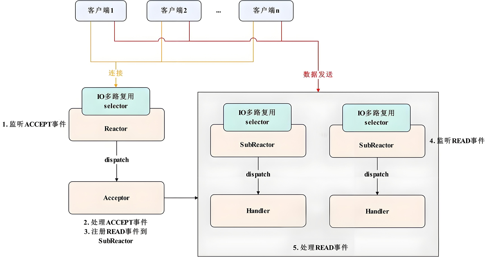

# MyTinyRPC
该项目是基于C++11开发的多线程异步RPC框架，采用主从Reactor架构，利用epoll实现IO多路复用，并在应用层基于protobuf自定义RPC通信协议。同时，使用xml配置文件实现配置与代码的解耦。

## 1 项目依赖与构建
项目依赖库如下：
1. `protobuf`
2. `tinyxml`

编译与安装：
```
cd MyTinyRPC
make
make install
```

## 2 目录结构
* `bin`: 保存了测试代码编译出来的可执行文件。
* `conf`: 保存了XML配置文件。
* `lib`: 保存了项目的最终构建产物RPC库：libmytinyrpc.a
* `log`: 保存服务器运行时产生的日志文件，分为底层信息及业务层信息，支持在xml文件`<log_max_file_size>`标签中自定义日志大小，当日志超出该大小即会产生新的日志文件。
* `obj`: 保存项目构建时的中间产物。
* `src`: 源码目录：
    * `common`: 保存通用设施的源码，例如日志、配置、错误码、互斥锁等等。
    * `net`: 包括了RPC模块、服务器与客户端模块以及Eventloop模块。
* `testcases`: 测试代码及protobuf文件保存区。

## 3 模块介绍

### 3.1 日志模块
服务器底层日志的格式如下：
`[日志级别]  [时间]  [进程号:线程号]  [文件名：行数]  日志内容`
1. 日志级别：分为`DEBUG < INFO < ERROR`，可在`<log_level>`标签内配置日志级别。
2. 时间格式：年-月-日 时-分-秒-毫秒

对于应用层日志，还额外增加了消息序号和所调方法两条信息：
`[日志级别]  [时间]  [进程号:线程号]  [消息序号]  [所调用方法]  [文件名：行数]  日志内容`

### 3.2 配置模块
配置文件在`/conf/sever_config.xml`中被定义，具体内容如下：
```xml
<?xml version="1.0" encoding="UTF-8" ?>
<root>
  <log>
    <log_level>日志级别</log_level>
    <log_file_name>日志前缀名</log_file_name>
    <log_file_path>日志存储路径</log_file_path>
    <log_max_file_size>单个日志的最大大小</log_max_file_size>
    <log_sync_interval>异步写日志的时间间隔</log_sync_interval>
  </log>

  <server>
    <port>服务器端口号</port>
    <io_threads>subReactor数量</io_threads>
  </server>

</root>
```

## 3.3 TCP Buffer模块
为了方便数据处理，特别是应用层的包组装和拆解，引入了 TCP Buffer 模块，有如下好处：
1. 方便异步的发送（发送数据直接塞到发送缓冲区里面，等待 epoll 异步去发送）。
2. 提高发送效率，多个包合并一起发送。

TCP Buffer 的底层为`vector<char>`，主要依靠头指针与尾指针，支持缓存的动态扩容以及Resize（避免无节制扩容）。在服务器端，设计了两个 buffer：
- `in_buffer`: 服务端调用 `read` 成功从 socket 缓冲区读到数据，会写入到 `in_buffer` 后面服务端从 `in_buffer` 前面读取数据，进行解码得到请求。
- `out_buffer`: 服务端向外发送数据，会将数据编码后写入到 `out_buffer` 后面服务端在 fd 可写的情况下，调用 `write` 将 `out_buffer` 里面的数据全部发送出去。


## 3.4 RPC模块
### 3.4.1 RPC编码模块
自定义MyPB协议报文的格式如下：

`| 0x02 | 整包长度 | MsgID长度 | MsgID | 方法名长度 | 方法名 | 错误码 | 错误信息长度 | 错误信息 | Protobuf序列化数据 | 0x03 |`

#### 字段说明:

1. **开始符**: 固定为 0x02
2. **整包长度**: 整个包的字节数，包含开始符和结束符
3. **MsgID长度**: length of MsgID
4. **MsgID**: 唯一标识 RPC 请求，一次 RPC 的请求和它的响应的 MsgID 应当一致
5. **方法名长度**: length of 方法名字
6. **方法名**: RPC 方法的完整名
7. **错误码**: 若 RPC 调用发生系统异常，此错误码被设置，正常为 0
8. **错误信息长度**: length of 错误信息
9. **错误信息**: 若 RPC 调用发生系统异常，详细错误信息被设置于此
10. **Protobuf序列化数据**: 使用 Protobuf 库将 Message 对象序列化后的结果
11. **校验码**: 对整包进行校验，用于防篡改。校验算法待定。
12. **结束符**: 固定为 0x03
> 注意: 所有的整数均为网络字节序 (大端存储)

### 3.4.2 服务器端
服务端的调用流程：

`read -> decode -(request)-> dispatcher -(response)-> encode -> write`

主事件循环通过 `TCPAcceptor` 监听 EPOLLIN 事件（`socket->bind->listen`），当有新的 TCP 请求到达时执行 `onAccept`。将 IO 事件分配给子事件循环。服务器的工作流程如下：
- `onRead`：只读取数据并放入 `in_buffer`，然后调用 `execute`。
- `execute`：从 `in_buffer` 解码数据，处理 RPC 请求，将数据编码到 `out_buffer`，然后调用 `onWrite`。
- `onWrite`：只写出 `out_buffer` 中的数据。

### 3.4.3 客户端
客户端的调用流程：

`connect -(request)-> encode -> write -> |服务器处理| ->  read -> decode -(response)->`

客户端只有一个事件循环，以异步方式包装连接方法。成功连接到服务器后，调用读写方法（也是异步的）：
- `onRead`：只读取数据并放入 `in_buffer`，然后调用 `execute`。
- `execute`：从 `in_buffer` 解码数据，执行完成回调。
- `onWrite`：将数据编码到 `out_buffer` 中，然后写出 `out_buffer` 中的数据。

## 3.5 主从Reactor模块
本服务器中，mainReactor 由主线程运行：通过 `epoll` 监听 `listenfd` 的可读事件，当可读事件发生后，调用 `accept` 函数获取`clientfd`，然后随机取出一个 subReactor，将 `cliednfd` 的读写事件注册到这个 subReactor 的 `epoll` 上即可。mainReactor 只负责建立连接事件，不进行业务处理，也不关心已连接套接字的IO事件。subReactor 通常有多个，每个 subReactor `由一个线程来运行。其注册clientfd` 的读写事件，当发生IO事件后，需要进行业务处理。


本项目封装 `epoll` 调用以及 `epoll_event` 事件为 Eventloop模块，IO 事件的执行与监听分离，主要为向任务队列中加入待执行的回调函数，直至下一次循环时**异步**执行，核心的流程如下：
```c
while(!m_stop_flag) {
    ScopeMutex<Mutex> lock(m_mutex); 
    std::queue<std::function<void()>> tmp_tasks; 
    m_pending_tasks.swap(tmp_tasks); 
    lock.unlock();

    while (!tmp_tasks.empty()) {
        std::function<void()> cb = tmp_tasks.front();
        tmp_tasks.pop();
        if (cb) {
            cb();
        }
    }

    int timeout = g_epoll_max_timeout; 
    epoll_event result_events[g_epoll_max_events];
    int rt = epoll_wait(m_epoll_fd, result_events, g_epoll_max_events, timeout);

    if (rt < 0) {
        ERRORLOG("epoll_wait error, errno=%d, error=%s", errno, strerror(errno));
    } else {
        for (int i = 0; i < rt; ++i) {
            epoll_event trigger_event = result_events[i];
            FdEvent* fd_event = static_cast<FdEvent*>(trigger_event.data.ptr);

            if (fd_event == NULL) {
                ERRORLOG("fd_event = NULL, continue");
                continue;
            }

            if (trigger_event.events & EPOLLIN) { 
                addTask(fd_event->handler(FdEvent::IN_EVENT));
            }
            if (trigger_event.events & EPOLLOUT) { 
                addTask(fd_event->handler(FdEvent::OUT_EVENT));
            }
            if (trigger_event.events & EPOLLERR) {
                DEBUGLOG("fd %d trigger EPOLLERROR event", fd_event->getFd())
                // 删除出错的套接字
                deleteEpollEvent(fd_event);
                if (fd_event->handler(FdEvent::ERROR_EVENT) != nullptr) {
                    DEBUGLOG("fd %d add error callback", fd_event->getFd())
                    addTask(fd_event->handler(FdEvent::OUT_EVENT));
                }
            }
        }
    }
}

```
> m_pending_tasks 中注册的任务包括定时器任务、wakeup事件、连接时间、读写事件等。

## 参考内容
1. [主从Reactor模型详解](https://blog.csdn.net/ww2651071028/article/details/129544697)

